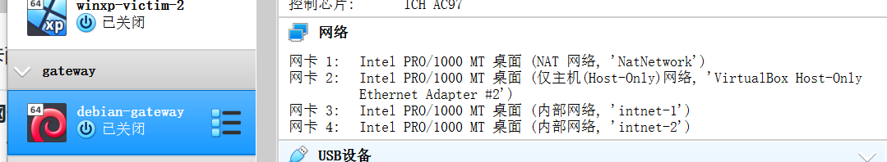
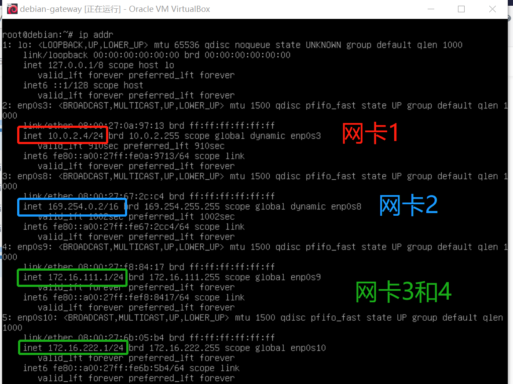
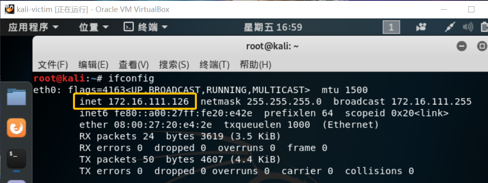
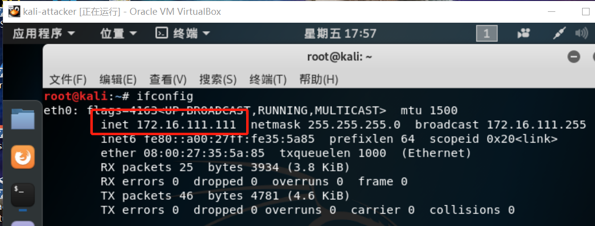
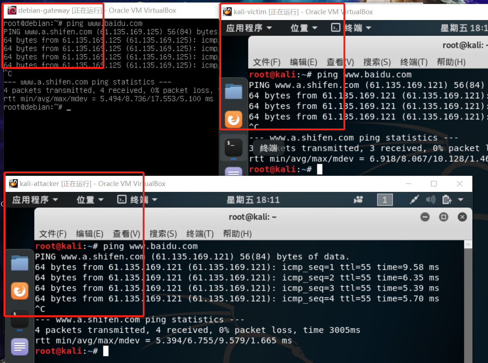
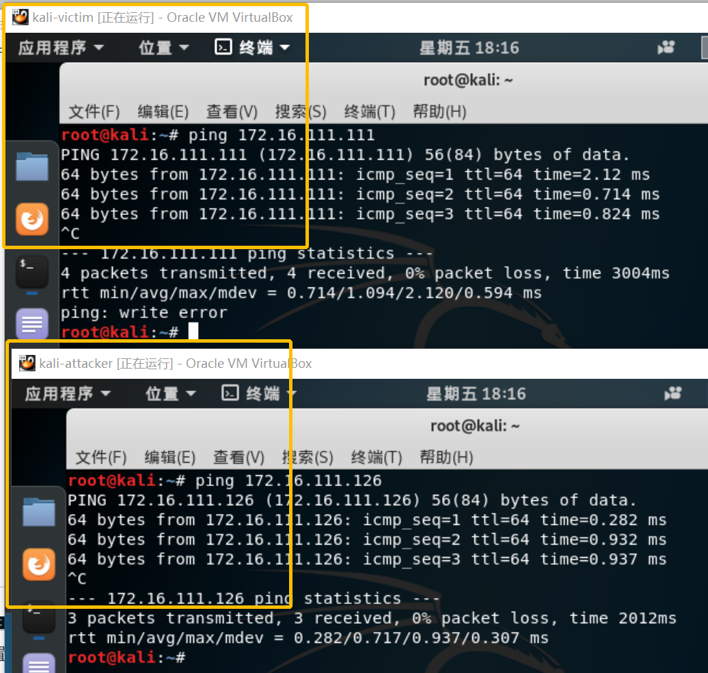
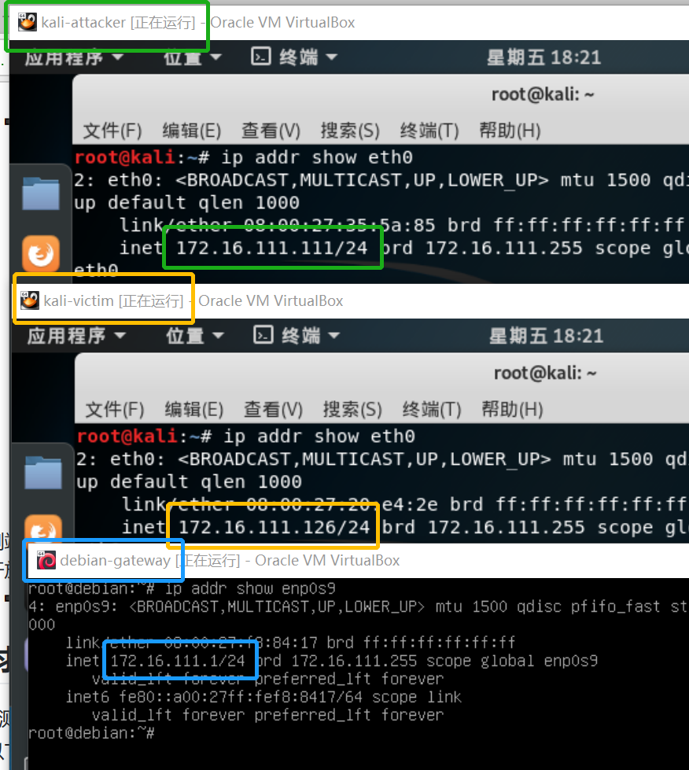
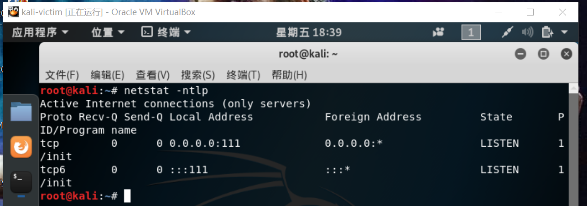
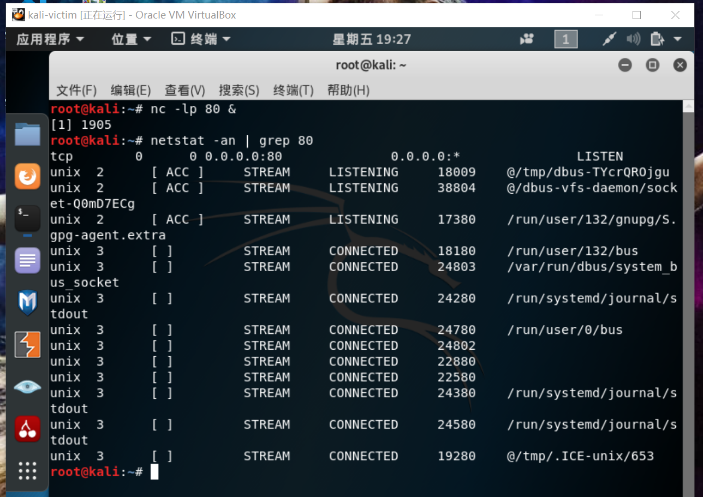

# 基于scapy的端口扫描

### 实验目的

掌握网络扫描的端口状态的基本原理。

### 实验环境

- 编程工具：python
- 编程语言：scapy
- 网络拓扑：网关（debian）、靶机（kali）、攻击者主机（kali）

### 实验步骤

#### 第一步：搭建网络拓扑

检查网关的物理层和网卡配置。

- 物理层

  

- 网卡配置

  

检查靶机的网络配置。

- 靶机ip

  

- 添加新网卡（host-only）方便主机远程控制

  

检查攻击者主机的网络配置。

- 使攻击者和靶机在同一个内网（ip地址都为 172.16.111.xxx）

  

#### 第二步：测试网络连通性

三台虚拟机均能连接互联网。



测试内网连通性。

- 靶机和主机可以相互连通

  

- 查看网关、靶机、攻击者的ip信息

  

#### 第三步：按照实验要求进行操作

*实验要求：*

*完成以下扫描技术的编程实现。*

*每种扫描技术的实现测试均需要测试端口状态为：**开放**、**关闭**和**过滤**状态时的程序执行结果。*

*提供每一次扫描测试的**抓包结果**并**分析**与课本中的扫描方法原理是否相符？如果不同，试分析原因。*

*在实验报告中详细说明实验**网络环境拓扑**、被测试 IP 的**端口状态**是如何模拟的。*

- *TCP connect scan / TCP stealth scan*
- *TCP Xmas scan / TCP fin scan / TCP null scan*
- *UDP scan*

##### TCP端口扫描

- 查看此时处于开放状态的端口

  

- 由于80端口没有被使用，所以开启80端口

  ```
  nc -lp 80 &
  netstat -an | grep 80
  ```

  

- 过滤80端口

  