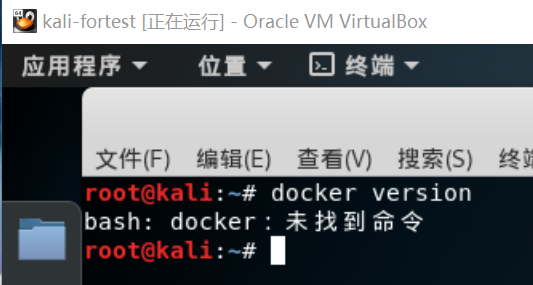
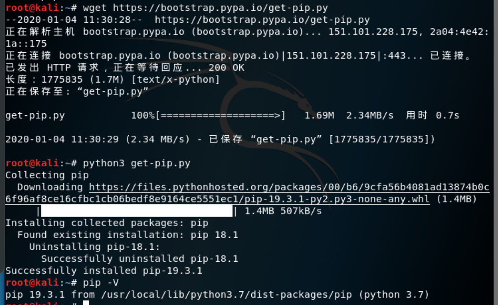
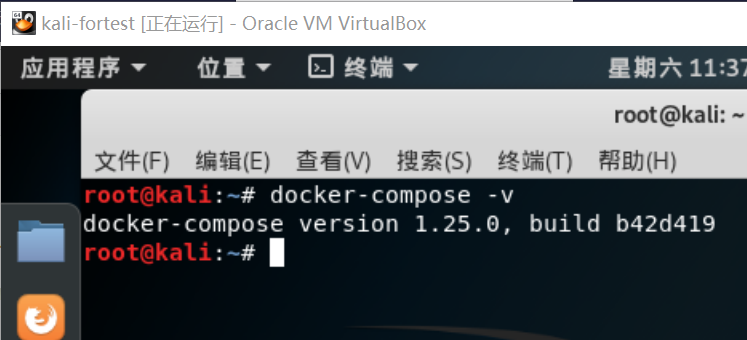
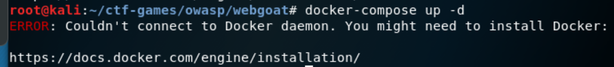

# Web应用漏洞攻防

### 实验目的

1、了解常见web漏洞训练平台；

2、了解常见web漏洞的基本原理；

3、掌握OWASP top 10和常见web高危漏洞的检测、利用和修复方法。

### 实验环境

- webgoat

- juice shop

- 虚拟机主机（kali）

- docker

### 实验要求

每个实验环境完成至少**5种**不同漏洞类型的漏洞利用训练。

### 实验过程

#### 第一步：搭建webgoat

在kali系统的虚拟机中输入命令：

`docker version`

显示结果为“未找到命令”，说明虚拟机并未安装docker。

然后安装docker-compose。（这一步本来想用yum安装docker，发现太复杂）

- 先安装pip

  

- 使用pip安装docker-compose

  `pip install docker-compose`

  

使用老师提供的代码，配置环境：

`一次获取所有文件（包括所有子模块管理的文件）`

`git clone https://github.com/c4pr1c3/ctf-games.git --recursive`
`cd ctf-games`

`（可选）单独更新子模块`

`git submodule init && git submodule update`

`启动 webgoat 系列服务`

`cd owasp/webgoat/ && docker-compose up -d`

很不幸的是，这里启用webgoat出错了，提示如下：

