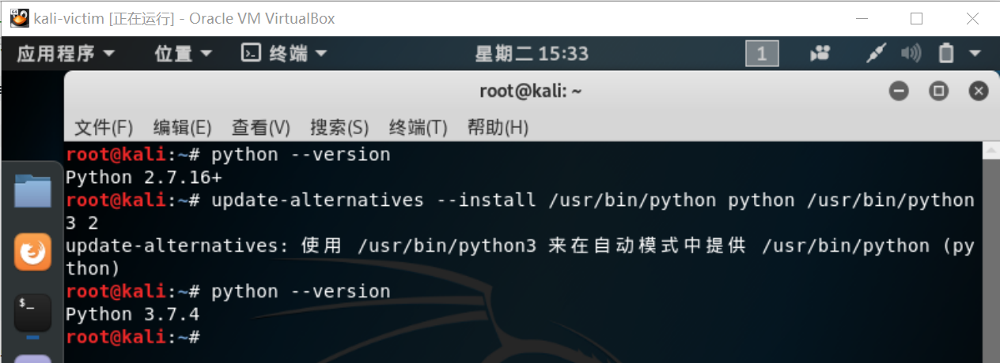
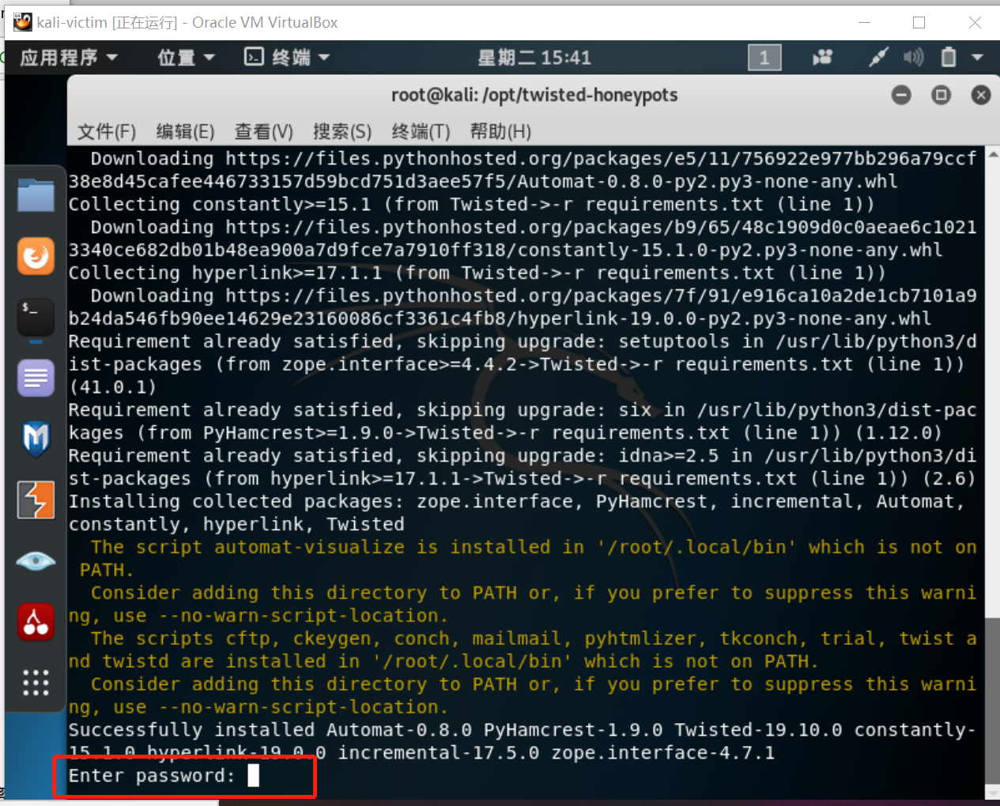
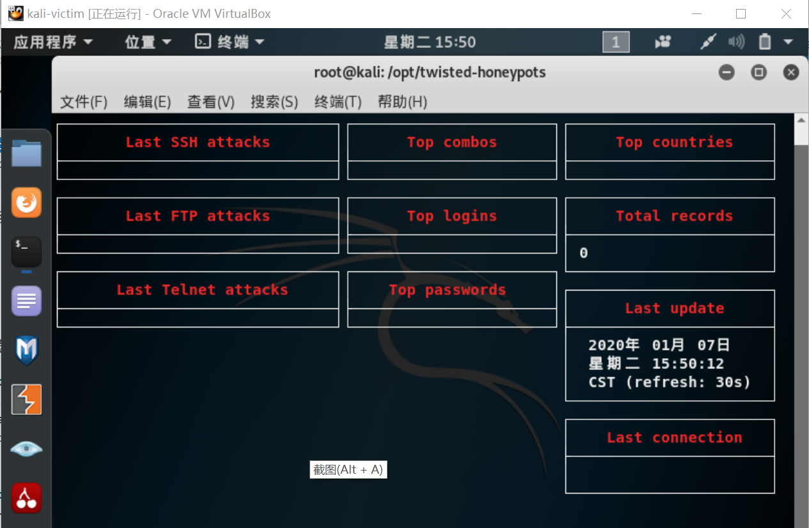

# 常见蜜罐

### 实验目的

了解蜜罐的分类和基本原理；

了解不同类型蜜罐的应用场合；

掌握常见蜜罐的搭建和使用。

### 实验环境

- 从`paralax/awesome-honeypots`中选择一种低交互蜜罐和一种中等交互蜜罐进行搭建实验（推荐SSH蜜罐）

- 网络拓扑结构

- 一台靶机和一台攻击者主机，网络均设置为NAT网络

### 实验要求

1、记录蜜罐的详细搭建过程；

2、使用 nmap 扫描搭建好的蜜罐，并分析扫描结果，同时分析扫描期间蜜罐上记录得到的信息；

3、如何辨别当前目标是一个蜜罐？以自己搭建的蜜罐为例进行说明。

### 实验过程

首先搭建低交互蜜罐。

- 在靶机上升级python版本

  

- 安装蜜罐

  `pip3 install service_identity` 

  `git clone https://github.com/lanjelot/twisted-honeypots /opt/twisted-honeypots`
  `cd /opt/twisted-honeypots`
  `service mysql start`
  `sudo ./install.sh && ./setup-db.sh`

  

- 输入密码

  尝试输入root的密码，可以运行。（虽然我也不知道这个密码是怎么回事）

- 运行蜜罐

  `sudo ./start.sh`
  `sudo ./stop.sh`（先不执行stop）

- 查看攻击者的行为

  `./monitor.sh`（此时还未开始攻击）

  

- 蜜罐测试，登录ssh（本靶机的ip为10.0.2.6）

  `ssh root@10.0.2.6`

  之后按照提示输入命令：

  `ssh -c aes128-cbc root@10.0.2.6`

  `tail -F /var/log/twistd-pot.log`

  并未显示任何结果，疑似未登录成功，因为ssh之后没有显示“successfully log in”之类的语句。

- 用 nmap 扫描该蜜罐

  